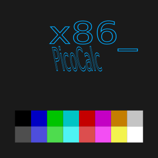

# PicoCalc x86



8086/80186 emulator for **ClockWorkPi PicoCalc** (https://www.clockworkpi.com/picocalc)
with Raspberry Pi Pico 2 board.

The project based on great 8086tiny project (https://github.com/adriancable/8086tiny) by Adrian Cable.

## Using
* https://github.com/elehobica/pico_fatfs for storage and disk access
    * https://elm-chan.org/fsw/ff/ upstream FatFs project
* https://github.com/polpo/rp2040-psram for PSRAM access
    * https://github.com/polpo/rp2040-psram/pull/15 using my PR for QPI mode

The project is targeting **Raspberry Pi Pico 2 RISC-V Hazard3** cores, no plans for ARM cores.
If someone wants to run on ARM cores it would be very easy to adapt it.

## Specs

### RAM
In stock config:
* available conventional **RAM is 442368(0x6C000) bytes, or 432 KB**
* 16 KB video ram for CGA
* 16 KB for BIOS and internal usage

### Performance
It's around ~1 MIPS, so it's like overpowered IBM PC XT or PS/2 model 30.

### Video and Display
CGA video adapter

   * text modes 80x25 and 40x25 (Passing all CGA text test from `CGA_COMP` utility).
   * graphic modes 4 and 6 (issues with text output during graphics WIP, some tests not passed).
   * 4x10 Font is used to support 80x25 default text mode.
   * Margins on the top and bottom of the screen to correct aspect ratio. 

### Sound
   * PC Speaker supported.

### Serial
   * Pico UART0 connected as COM1, BIOS interrupts(up to 9600) and direct mode working up to 57600 (tested with https://github.com/go4retro/tcpser for accessing telnet BBS via modem emulation on host PC).
   * XON/XOFF software flow control method must be used.

### Keyboard
   * Keyboard works with hotkeys available like ALT+F1, CTRL+G etc.
   * Short press on PicoCalc Power button doing warm reboot if latest south bridge firmware flashed.  


## Getting Started

Firmware images are available only for Raspberry Pi Pico 2.

* Find prebuilt disk images with MS DOS 4.0 or SvarDOS and PicoCalc x86 firmware images in Releases (https://github.com/shtirlic/picocalc_x86/releases)

* Load uf2 firmware image via `picotool` or USB mass storage method.
* Format SD card with FAT32 file system, create `x86` dir in the root and put desired `hd.img` into it, so the resulting path on the SD Card is `/x86/hd.img`

### Disk Images

#### How to make your own `hd.img`

```
dd if=/dev/zero of=hd.img bs=1M count=256
```

mount new disk in `dosbox`, usage of `mount` or `imgmount` command depends on your dosbox version
```
mount c hd.img -t hdd -fs none -size 512,63,8,1024
```

* Use `fdisk` to create partition table and make it bootable.
* Install the operating system.

Then you can mount your `hd.img` and transfer files in `dosbox` via:

Example: 63 sectors pert track, 8 heads, 1024 sectors, 512 bytes per sector
(63*8*1024*512) = 264241152 bytes so 256mb drive.

```
mount c hd.img -t hdd -fs fat -size 512,63,8,1024
```

* Transfer to SD card to `/x86/hd.img` location.

### Floppy

Floppy supported as image `/x86/fd.img` if not present in startup time, blank floppy image wil be created.

### Serial / Modem / File Transfers

#### File Transfers

You can transfer files between PicoCalc x86 and host PC running terminal(zmodem)
or using `DDLINK` utility https://dunfield.themindfactory.com/dnld/DDLINK.ZIP by Dave Dunfield
running on dosbox and PicoCalc x86, it provides Norton Commander style interface
to transfer files between PCs.


dosbox as client
```
ddlink c=1,57600
```

PicoCalc x86 as server
```
ddlink /s c=1,57600
```
Transfer speed is around ~6KB/sec

#### Modem emulation

Use https://github.com/go4retro/tcpser for example on linux host

Example
```
./tcpser -d /dev/ttyUSB0 -s 57600 -l 7  -i "s0=1&k4e1" -n123=amnesiabbs.duckdns.org
```

This starts host modem emulation on `ttyUSB0` (PicoCalc Pico uart port connected via USB-C)

Explanation of modem init command `"s0=1&k4e1"`:
>It will pick up the phone after one ring, enable XON/XOFF software flow control and enable
echo modem commands. Also adds speed dial for `123` number, so in terminal you could dial via `ATDT123` and then connect via emultion/proxy to the telnet `amnesiabbs.duckdns.org`
The current BBS list can be found here https://www.telnetbbsguide.com

For the terminal I suggest using shareware Qmodem Lite 4.5 https://winworldpc.com/product/qmodem/45 or better alternative.


## Building

### Must
 * ClockworkPi PicoCalc with Raspberry Pi Pico 2 compatible board installed
 * Git
 * nasm (https://github.com/netwide-assembler/nasm/)
 * Cmake
 * pico-sdk 2.3.0 (https://github.com/raspberrypi/pico-sdk) (/usr/share/pico-sdk)
 * riscv-none-elf gcc (https://github.com/xpack-dev-tools/riscv-none-elf-gcc-xpack)

### Optional
 * dosbox-x (https://dosbox-x.com) or dosbox-staging (https://www.dosbox-staging.org)
 * Krita for svg splash
 * Pixelorama for font editing (https://pixelorama.org/)
 * LCD Image converter for splash/fonts/images to C headers files (https://lcd-image-converter.riuson.com)


```
git clone --recurse-submodules https://github.com/shtirlic/picocalc_x86
```

## Todo

 * [ ] Fix CGA text output in graphics mode for mode 4 and mode 6
 * [ ] Add good 8x8 font for 40 column text mode
 * [ ] Make screenshot function (hotkey) via saving on SD Card
 * [ ] Support boards with soldered PSRAM connected via QMI like Pimoroni Pico 2 Plus (map memory up to 736kb)
 * [ ] EMS 3.2 full testing and XMS on top of it
 * [x] UART passthrough to host PC as COM1 (modem etc.)
 * [ ] Pico 2 W some network emulation
 * [ ] CDC ACM NCM support
 * [ ] Pico 2 LED support
 * [x] Support ctrl+f1 or alt+f1 and other keystrokes
 * [ ] MCGA? mode 13h 320x200 256-color mode via PSRAM
 * [ ] More hardware devices emulation
 * [x] Add floppy support via fd.img
 * [ ] BIOS boot menu
 * [ ] Better emulation for disk subsystems
 * [ ] Enable bios override from SD card
 * [ ] Support backlights and power resets via https://git.jcsmith.fr/jackcartersmith/picocalc_BIOS
 * [ ] Power management / battery reporting
 * [ ] Pass all test for CGA comp https://github.com/MobyGamer/CGACompatibilityTester
 * [ ] Battery / performance and status overlay at the top of the screen, shortcut helpers at the bottom 
